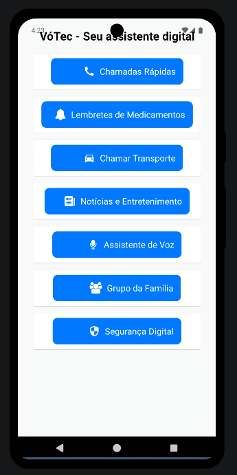
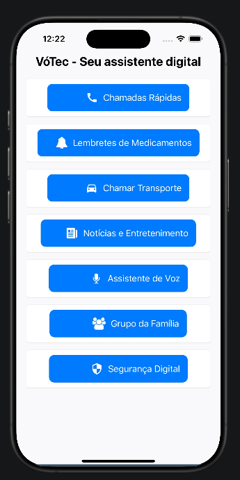

# VóTec - Seu Assistente Digital para Idosos

VóTec é um aplicativo intuitivo e acessível desenvolvido para facilitar a vida dos idosos, oferecendo funcionalidades essenciais como chamadas rápidas, lembretes de medicamentos, segurança digital e muito mais.

## 📱 Funcionalidades Principais

- **📞 Chamadas Rápidas** - Acesso fácil a contatos favoritos e botão de SOS.
- **💊 Lembretes de Medicamentos** - Alertas para tomar remédios e ir a consultas.
- **🚖 Chamar Transporte** - Facilidade para chamar um táxi ou Uber.
- **📰 Notícias e Entretenimento** - Acesso a rádio, jornais e jogos simples.
- **🎙 Assistente de Voz** - Leitura de mensagens e comandos de voz.
- **👨‍👩‍👧‍👦 Grupo da Família** - Comunicação direta com familiares.
- **🔒 Segurança Digital** - Alertas e dicas contra golpes online.

## 🛠 Tecnologias Utilizadas

- **React Native**
- **React Native Paper** (Componentes visuais)
- **Expo Icons** (Ícones do Material e FontAwesome)

## 📸 Capturas de Tela

### Android


### iOS


## 🚀 Como Executar

1. Clone este repositório:
   ```sh
   git clone https://github.com/gabsouza-dev/votec-app.git
   ```
2. Instale as dependências:
   ```sh
   npm install
   ```
3. Execute o app:
   ```sh
   expo start
   ```

## 📌 Contribuição
Sinta-se à vontade para abrir issues e enviar pull requests para melhorar o VóTec!

## 📄 Licença
Este projeto está sob a licença MIT.
